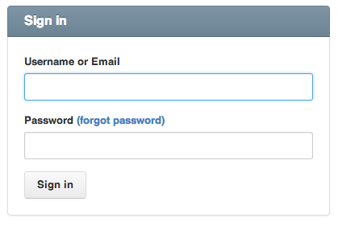

https://github.com/plataformatec/devise#getting-started

#BEWD - Authentication

###Bobby Tables

---

##Agenda

*	Review
	*	Rewsly Solution

*	Authentication
	*	Authentication Explained
	*	Devise Gem

---

##Review
###Rewsly

*	Let's review Rewsly solution from last class.

---

##Authentication

---

##Authentication

*	Use of a combination of username and password to validate user identity. (Obvious I know…)
*	Tracking a user's identity on our app through the __session__.

---

##Authentication
###Security

---

##Security
*	Can I view users' passwords in my app?

####NO!

---

##Security
###Storing Passwords

Bad practice to keep passwords in “clear text”

*	Passwords can't be stored in plain text in your database.
If your database is compromised then passwords are compromised as well.
	*	Don't use the same password for all sites.

---

##Security
###Hashing

Use one way hash

	Digest::SHA1.hexdigest("secret")
	# => "e5e9fa1ba31ecd1ae84f75caaa474f3a663f05f4"

---

##Security
###Adding Salt

Salt is random data that are used as an additional input to a one-way function that hashes a password.

	salt = "a761ce3a45d97e41840a788495e85a70d1bb3815"
	password = "secret"

	Digest::SHA1.hexdigest(salt + password)
	# =>"7963ca00e2e48ea80c615d037494de00a0964682"

---

##Authentication
###Managing Users

*	When the user is authenticated we store the user_id in the __session__.

---

##Managing Users
###Session

*	Session data commonly includes the browsing user’s identity (name, login, shopping cart, etc.).

*	Rails tracks the session across different requests unless you delete it, or the user deletes their cookie(s)

*	Commonly, web servers identify browsers by telling them to store a __cookie__.

---

##Managing Users
###Cookie

*	Used to store small bits of information (maximum size about 4k).
*	Cookies allow web servers to provide a temporary unique ID to a browser, to enable session management.
	*	Sensitive data (credit card numbers, etc.) should never be set in a cookie

---

##Authentication
###Gems
Creating authentication from scratch is a complex process (see resources for more info). However Developers have created Gems to make authentication "easy".

*	__Devise__
*	CanCan
*	Clearance
*	OmniAuth
*	DoorKeeper

---

##GEMS
###Packaged Ruby Libraries
*	A Gem is a packaged ruby library.
* Gems are commonly shared for you to use. (Remember `gem install rest-client` ?)
* Hosted on a gem server, the most used and public one is RubyGems (http://rubygems.org)

---

##Authentication
###Devise GEM
[Devise Documentation](https://github.com/plataformatec/devise)

*	Easy to implement, integrate and customize.
*	Handles complex security, so you don't have to.
*	Provides controller filters and view helpers (more on that in the code along).

---

## Pre Code Along

If you were unable to complete Rewsly, no big, but we do need a working copy for today.

Go to: https://github.com/bobbytables/rewsly_solution

In your terminal, `cd` into where you store your work for this class.

	git clone https://github.com/bobbytables/rewsly_solution.git
	cd rewsly_solution

---

## Post Pre Code Along

With a bit of luck A duck will come into your life. When you are at the peak of your great powers and your achievement towers.
Like a smoking chimney stack. There’ll be a quack,
And right at your feet, a little duck will stand.
She will take you by the hand and lead you,
Like a child with no defence;
She will lead you into wisdom, joy and innocence.
That little duck.
We wish you luck.

---

##Rewsly - Adding Devise

---

##Devise
###Recap

*	Adding Gems to the Gemfile

		gem 'devise', git: "https://github.com/plataformatec/devise.git", branch:  "rails4"

---

##Devise
###Recap

*	Using Devise

		rails g devise:install # creates all the devise Controllers, views and initializers
		rails g devise user    # creates User model (or modifies it if it exists)
		rake db:migrate        # Let's Go!

---

##Devise
###Recap

*	View helpers

		<%= user_is_logged_in? %>
		<%= current_user %>

---

##Authentication
###Recap

*	View helpers

		<%= user_is_logged_in? %>
		<%= current_user %>

		And many many more.

---

##Devise
###Recap

*	Blocking Access

		class ApplicationController ...
			before_action :authenticate_user!
		end

		class HomeController < ApplicationController
			skip_before_action :authenticate_user!
		end

---

##Devise
###Recap

*	Changing the default Route names

		devise_for :users, :path_names => { sign_in: 'login', sign_out: 'logout' }

---

##Lab Time - Ritly

---

## Homework

Write a list of information/data you want to store about your user.

---

## Resources

###Cheat Sheet

No cheat sheet this class. Remember, Google is your friend!

###Tips, Tricks & Advanced Reading

*	If you want to expand your knowledge about Rails authentication gems visit [Ruby Toolbox](https://www.ruby-toolbox.com/categories/rails_authentication) for a few more authentication gem options.

*	Great [article](http://scientopia.org/blogs/goodmath/2013/03/02/passwords-hashing-and-salt/) explaining passwords, hashing, and salt.

*	Advanced [article](http://edapx.com/2012/04/18/authorization-and-user-management-in-rails/) about authorization and users management in rails.

*	[Tutorial](http://everydayrails.com/2012/07/31/rails-admin-panel-from-scratch.html) on how to create an advanced admin panel.

*	[Authentication From Scratch](http://railscasts.com/episodes/250-authentication-from-scratch) Rails Cast

###Still Feel Lost?
####Catch Up With These Resources

*	[Devise](http://railscasts.com/episodes/209-introducing-devise) Rails Cast

